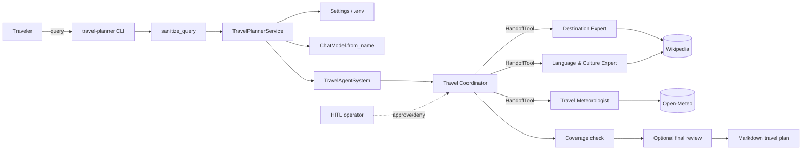
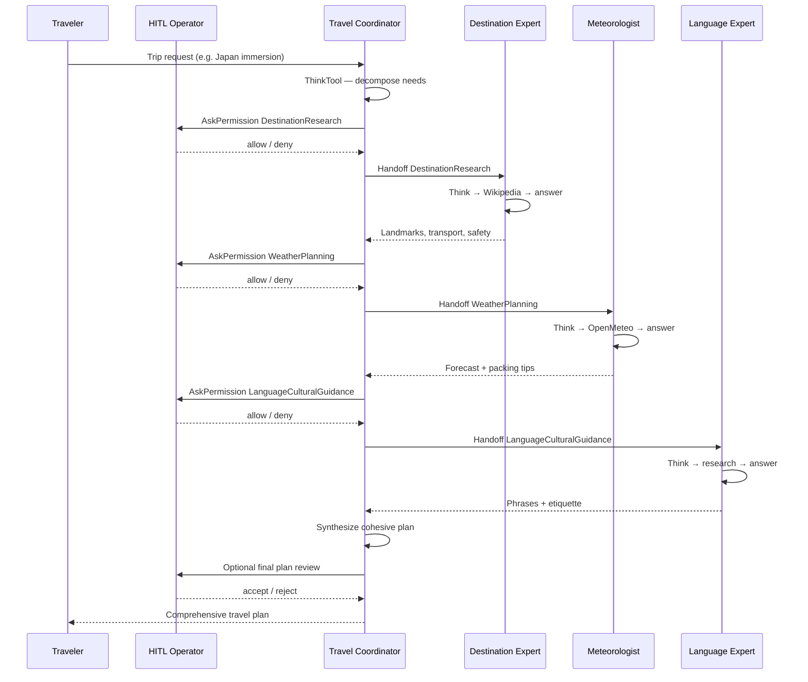
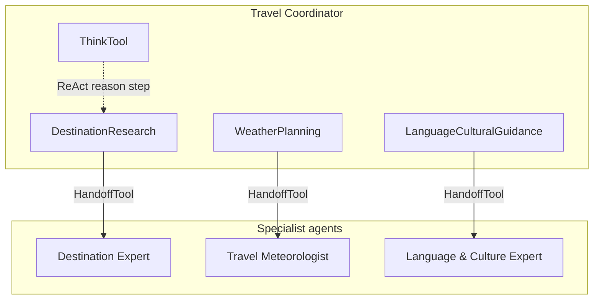
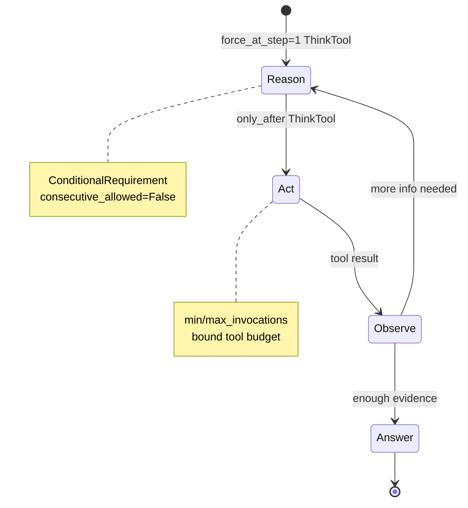
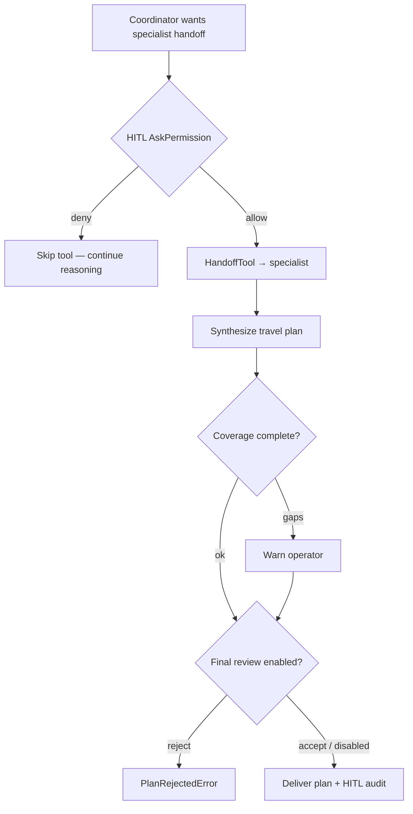
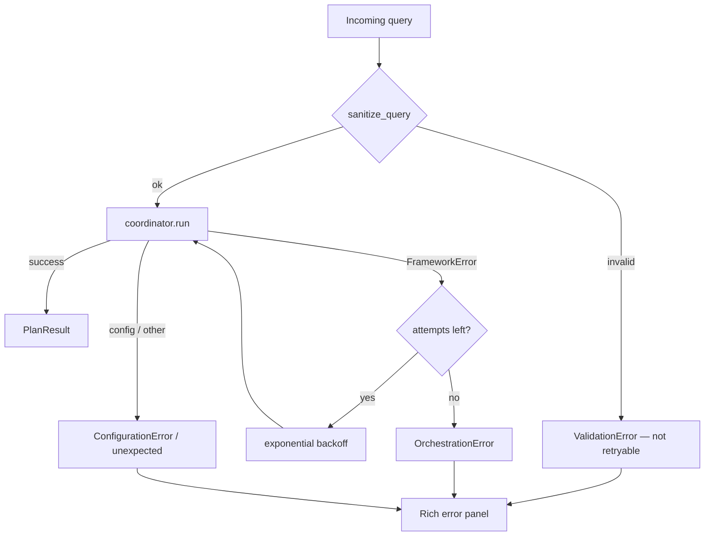

# Multi-Agent Travel Planner with BeeAI

Production-ready **multi-agent travel planning** system built on the [BeeAI Framework](https://framework.beeai.dev/). A **Travel Coordinator** orchestrates three specialists via `HandoffTool`, each specialist follows **ReAct** discipline with `ThinkTool` + `ConditionalRequirement`, **Human-in-the-Loop (HITL)** gates protect real-world plan accuracy, and failures are handled with **validation, retries, and structured error reports**.

> **Key Points:** multi-agent orchestration · ReAct logics · HITL for production accuracy · production error handling

---

## objectives

1. Orchestrate specialized BeeAI `RequirementAgent`s with `HandoffTool` (coordinator → specialists).
2. Enforce **ReAct** (Reason → Act → Observe → Answer) using `ThinkTool` and `ConditionalRequirement`.
3. Apply **HITL** with `AskPermissionRequirement` so a human approves specialist handoffs (and optionally the final plan) — critical for real-world production accuracy.
4. Ship production concerns: env-based config, query validation, coverage checks, retries, logging, CLI, and CI tests.

---

## Architecture overview

```text
┌──────────────────────────────────────────────────────────────────────────────┐
│                    Multi-Agent Travel Planner (BeeAI)                        │
│                                                                              │
│   CLI / REPL ──► validate ──► TravelPlannerService                           │
│                      │                 │                                     │
│                 Settings (.env)        ▼                                     │
│                               Travel Coordinator (RequirementAgent)          │
│                               ThinkTool + HandoffTools + HITL gates          │
│                                      │                                       │
│              ┌───────────────────────┼───────────────────────┐               │
│              ▼                       ▼                       ▼               │
│     Destination Expert      Travel Meteorologist    Language & Culture       │
│     Wikipedia + Think        OpenMeteo + Think       Wikipedia + Think       │
│                                                                              │
│   HITL: approve handoffs → coverage check → optional final plan review       │
│   Error path: ValidationError → FrameworkError retry → OrchestrationError    │
└──────────────────────────────────────────────────────────────────────────────┘
```

### System context



### Multi-agent orchestration

The coordinator never scrapes weather or Wikipedia itself. It **reasons**, then **delegates** through named handoff tools. Specialists return domain answers; the coordinator **synthesizes** a single traveler-facing plan. With HITL enabled, each handoff pauses for human approval so costly or inaccurate specialist calls never run blindly in production.



### Agent roles & tools

| Agent | Role | Tools | Requirements (control plane) |
| --- | --- | --- | --- |
| **Travel Coordinator** | Main interface / synthesizer | `ThinkTool`, 3× `HandoffTool` | No consecutive Think; **HITL** `AskPermissionRequirement` on handoffs |
| **Destination Expert** | Attractions, transport, safety | `ThinkTool`, `WikipediaTool` | Think forced at step 1; Wikipedia only after Think |
| **Travel Meteorologist** | Climate & packing | `ThinkTool`, `OpenMeteoTool` | Think first; OpenMeteo once after Think |
| **Language & Culture Expert** | Phrases, etiquette, norms | `ThinkTool`, `WikipediaTool` | Think forced at step 1 |



---

## ReAct logics

BeeAI does not invent a separate “ReAct agent” type here. **ReAct is enforced declaratively** on every `RequirementAgent`:

| Phase | Mechanism | Purpose |
| --- | --- | --- |
| **Reason** | `ThinkTool` + `ConditionalRequirement(..., force_at_step=1)` | Plan before acting; reduce impulsive tool spam |
| **Act** | Domain tools / `HandoffTool` with `only_after=[ThinkTool]` | Gather evidence only after reasoning |
| **Observe** | Tool results land in agent memory / trajectory | Inform the next Reason step |
| **Answer** | Final message / `expected_output` | Traveler-facing synthesis |



**Why this matters in production:** unconstrained tool loops are expensive and flaky across models. `RequirementAgent` normalizes behavior so weaker models still follow Think → Act order.

Documented profiles live in `src/travel_planner/orchestration/react.py` and are covered by architecture tests so code and docs stay aligned.

---

## Human-in-the-Loop (HITL) for production accuracy

Real travelers feel the cost of a wrong handoff: irrelevant weather, missed cultural norms, or unsafe destination advice. This project treats **HITL as a first-class production control**, not a demo toggle.

| Gate | Mechanism | Why it improves accuracy |
| --- | --- | --- |
| **Handoff approval** | BeeAI `AskPermissionRequirement` + audited Rich prompt | Human confirms each specialist call is warranted before it runs |
| **Coverage check** | Keyword signals for destination / weather / culture | Flags incomplete synthesis before delivery |
| **Final plan review** | Optional second HITL gate on the synthesized markdown | Operator accepts or rejects the traveler-facing answer |
| **Audit trail** | `ApprovalAuditLog` on `PlanResult.metadata["hitl"]` | Decisions are logged for debugging and compliance |



Enable in interactive / production sessions:

```bash
# Approve each specialist handoff
travel-planner --hitl

# Handoffs + accept/reject the final plan
travel-planner --hitl --hitl-final-review

# Env equivalents
# TRAVEL_PLANNER_HITL_ENABLED=true
# TRAVEL_PLANNER_HITL_FINAL_REVIEW=true
# TRAVEL_PLANNER_REQUIRE_HANDOFF_PERMISSION=true
```

---

## Error handling

Failures are classified and surfaced without leaking stack traces to the traveler by default.



| Layer | What happens |
| --- | --- |
| **Input** | Control chars stripped; empty / oversized queries rejected (`ValidationError`) |
| **Config** | Provider credentials checked before any LLM call (`ConfigurationError`) |
| **Runtime** | BeeAI `FrameworkError` retried with Tenacity exponential backoff |
| **Boundary** | Exhausted retries → `OrchestrationError`; HITL reject → `PlanRejectedError` |
| **Observability** | Rich console + `logs/travel_planner.log`; HITL audit on `PlanResult.metadata` |

---

## Repository layout

```text
.
├── README.md
├── pyproject.toml                 # packaging, deps, scripts, tool config
├── .env.example                   # secrets & runtime template
├── LICENSE
├── .github/workflows/ci.yml       # lint + unit tests
├── src/travel_planner/
│   ├── cli.py                     # production CLI + REPL
│   ├── config.py                  # pydantic-settings
│   ├── llm.py                     # ChatModel factory
│   ├── validation.py              # query sanitization
│   ├── errors.py                  # typed errors + classify_exception
│   ├── logging_setup.py
│   ├── agents/
│   │   ├── factory.py             # RequirementAgent builders
│   │   └── prompts.py             # role instructions & handoff copy
│   ├── orchestration/
│   │   ├── system.py              # assemble agents + resilient run
│   │   └── react.py               # documented ReAct profiles
│   ├── hitl/
│   │   ├── gates.py               # AskPermission handler + final review
│   │   └── coverage.py            # plan completeness signals
│   ├── services/
│   │   └── planner.py             # TravelPlannerService facade
│   └── models/
│       └── results.py             # PlanResult
└── tests/
    ├── test_architecture.py       # ReAct / role contracts
    ├── test_hitl.py               # HITL audit + coverage
    ├── test_validation_and_errors.py
    └── test_service.py            # service with mocked orchestration
```

---

## Quick start

### 1. Create environment

```bash
cd Multi-Agent-Travel-Planner-with-BeeAI
python3.11 -m venv .venv
source .venv/bin/activate
pip install -e ".[dev]"
```

### 2. Configure credentials

```bash
cp .env.example .env
```

Fill in values for your provider. Default model string:

```text
TRAVEL_PLANNER_LLM_MODEL=watsonx:meta-llama/llama-4-maverick-17b-128e-instruct-fp8
WATSONX_API_KEY=...
WATSONX_PROJECT_ID=...
WATSONX_URL=https://us-south.ml.cloud.ibm.com
```

Other providers work via BeeAI’s `provider:model` naming, for example:

| Provider | Example `TRAVEL_PLANNER_LLM_MODEL` | Extra install |
| --- | --- | --- |
| watsonx | `watsonx:ibm/granite-4-h-small` | set `WATSONX_*` env vars (via LiteLLM) |
| Ollama | `ollama:granite4:micro` | `pip install -e ".[ollama]"` |
| OpenAI | `openai:gpt-4o-mini` | set `OPENAI_API_KEY` |

### 3. Run

```bash
# Built-in Japan cultural-immersion demo
travel-planner --demo

# Production-style run with HITL handoff approvals
travel-planner --hitl "Weekend in Lisbon — food, weather, etiquette"

# HITL handoffs + final plan acceptance
travel-planner --hitl --hitl-final-review --demo

# One-shot query
travel-planner "Weekend trip to Lisbon — food, weather, and local etiquette"

# Interactive REPL
travel-planner

# Machine-readable output
travel-planner --demo --json
```

Or:

```bash
python -m travel_planner --demo
```

---

## How the pieces map to BeeAI

```python
# Coordinator owns handoffs — this is multi-agent orchestration
HandoffTool(destination_expert, name="DestinationResearch", ...)
HandoffTool(travel_meteorologist, name="WeatherPlanning", ...)
HandoffTool(language_culture_expert, name="LanguageCulturalGuidance", ...)

# ReAct: reason before act
ConditionalRequirement(ThinkTool, force_at_step=1, consecutive_allowed=False)
ConditionalRequirement(WikipediaTool, only_after=[ThinkTool], min_invocations=1)

# Optional interactive gate on expensive handoffs (HITL)
AskPermissionRequirement(
    ["DestinationResearch", "WeatherPlanning", "LanguageCulturalGuidance"],
    handler=create_handoff_permission_handler(audit),
    remember_choices=True,
)
```

Enable with `--hitl`, `--hitl-final-review`, or:

```text
TRAVEL_PLANNER_HITL_ENABLED=true
TRAVEL_PLANNER_HITL_FINAL_REVIEW=true
TRAVEL_PLANNER_REQUIRE_HANDOFF_PERMISSION=true
```

---

## Development

```bash
ruff check src tests
pytest -q
```

CI runs the same lint + tests on Python 3.11 and 3.12 (see `.github/workflows/ci.yml`).

---

## Design choices (production)

| Choice | Rationale |
| --- | --- |
| `RequirementAgent` over free-form agents | Declarative constraints → predictable tool use across LLMs |
| Coordinator + handoffs | Clear ownership; specialists stay least-privilege |
| Think-before-tool requirements | Explicit ReAct; fewer wasted API / Wikipedia / weather calls |
| **HITL handoff + final review** | Human accountability for accuracy before traveler delivery |
| Coverage heuristics | Cheap signal that a plan omitted a specialist domain |
| Service facade + CLI | Thin UI; business flow testable without a terminal |
| Tenacity around `FrameworkError` | Absorb transient provider / network blips |
| pydantic-settings | 12-factor config; no hardcoded secrets |

---

## Sample demo query

The `--demo` flag runs:

> I'm planning a 2-week cultural immersion trip to Japan (Tokyo and Osaka) as a first-time visitor. I want to experience traditional culture, visit historical sites, and interact with locals. I speak only English and want to be respectful of Japanese customs. What should I know about the destination, weather expectations, and language/cultural tips?

Expect the coordinator to consult all three specialists and return a markdown plan covering destination, weather, and cultural guidance.

---

## References

- [BeeAI Framework docs](https://framework.beeai.dev/)
- [Requirement Agent](https://framework.beeai.dev/modules/agents/requirement-agent)
- [Backend / ChatModel providers](https://framework.beeai.dev/modules/backend)
- Upstream multi-agent example: [`multi_agent.py`](https://github.com/i-am-bee/beeai-framework/blob/main/python/examples/agents/requirement/multi_agent.py)

---

## License

MIT — see [LICENSE](LICENSE).
